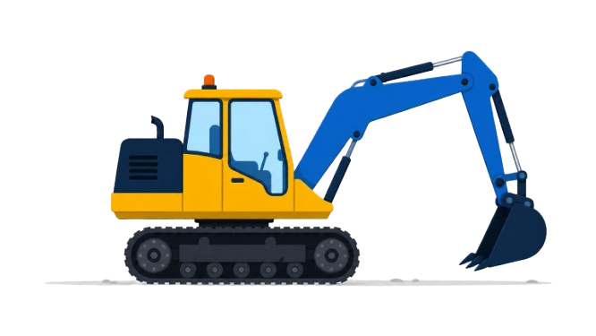

# 🚜 Gerador de Currículo SIDY

Aplicação web mobile-first que permite aos alunos do **Curso de Operador de Máquinas Pesadas da SIDY Escola de Profissões** preencher seus dados e gerar um currículo profissional em PDF, pronto para envio.

Sem cadastro, sem login e sem instalação. Preencha, revise, gere e compartilhe direto pelo celular.

## 🔗 Acesse o projeto

🔴 **https://curriculosidy.vercel.app/**

## 🖼️ Tela inicial



## ✨ Funcionalidades

- Fluxo em 4 etapas: Início → Preencher → Revisar → Gerar/Compartilhar
- Formulário completo com validação dos campos obrigatórios
- Foto de perfil com preview (galeria ou câmera)
- Máquinas selecionáveis com atalho "Selecionar todas"
- Certificação Premium SIDY com inserção automática das NRs
- Experiência profissional (até 2) com validação
- Prévia em A4 antes da geração
- Exportação em PDF, impressão e compartilhamento no WhatsApp
- Totalmente responsivo para celular

## 🛠️ Tecnologias

- HTML5, CSS3 e JavaScript (arquivo único)
- Basecoat CSS
- Google Fonts (Inter e Poppins)
- html2canvas
- jsPDF

## 📁 Estrutura

```
curriculo_sidy/
├── index.html              # Aplicação completa (HTML, CSS e JS)
└── img/                    # Logo, banner e ícones das máquinas
```

## 📋 Como usar

1. **Início**: clique em "Começar meu currículo"
2. **Preencher**: informe os dados, adicione a foto e selecione as máquinas
3. **Revisar**: confira a prévia e edite se necessário
4. **Gerar**: baixe o PDF ou compartilhe no WhatsApp

**Campos obrigatórios**: nome completo, cidade, estado e telefone/WhatsApp.

## 📄 Currículo gerado

- Formato A4 (210 × 297 mm), preferencialmente em uma página
- Cabeçalho com foto, contatos e CNH
- Seções: Objetivo, Formação, Máquinas, Certificações/NRs, Experiência e Informações Adicionais
- Nome do arquivo sugerido: `Curriculo_NomeSobrenome_OperadorMaquinas.pdf`

## 📌 Próximos passos

- [ ] Salvar dados temporariamente (evitar perda ao recarregar)
- [ ] PDF com texto selecionável
- [ ] Melhorias de acessibilidade

---
